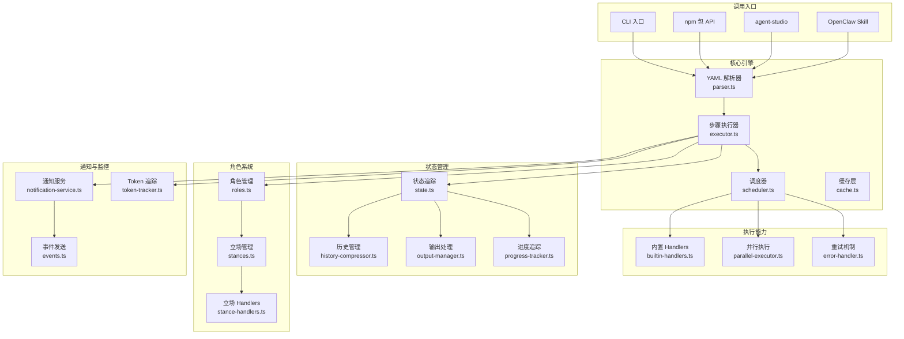
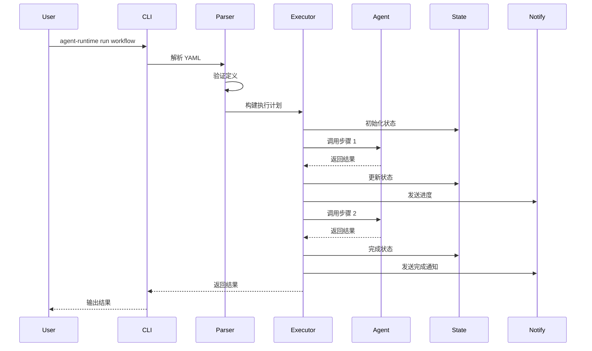
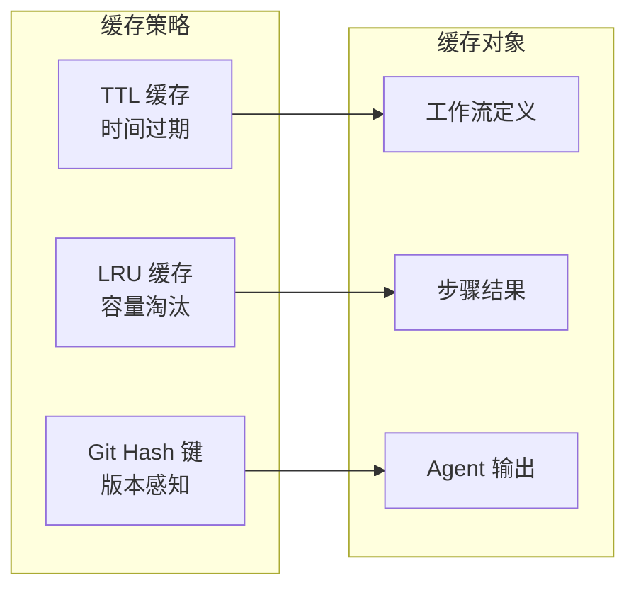
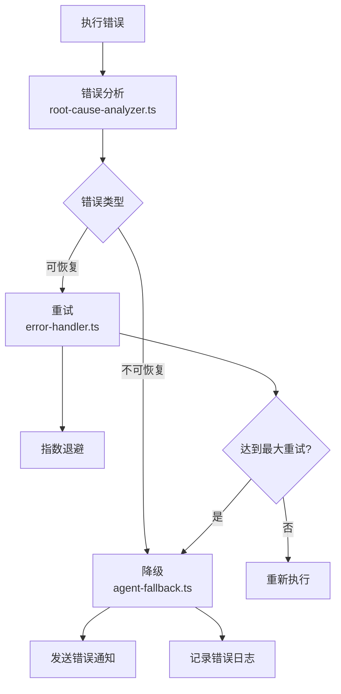
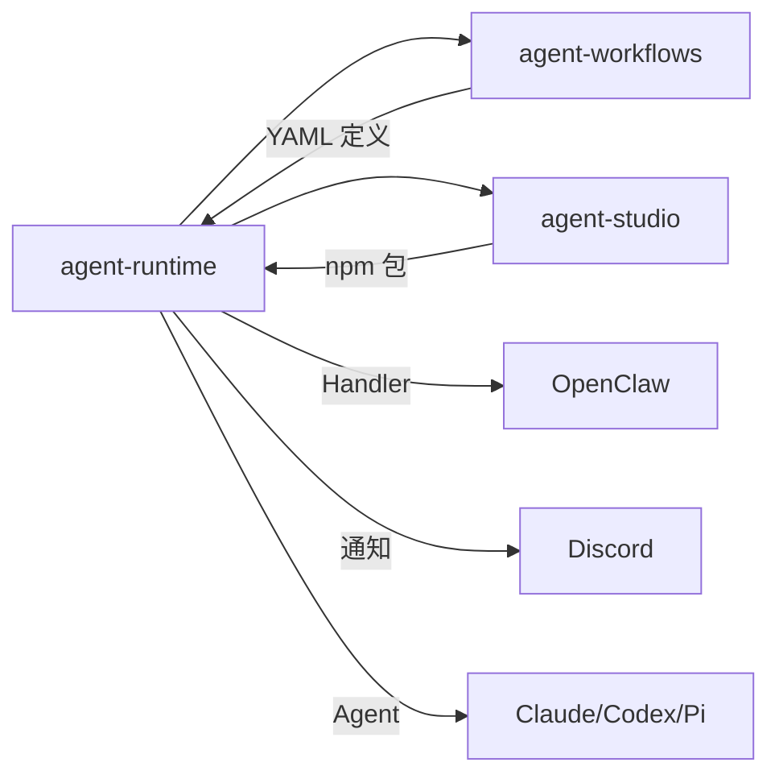

# Agent Runtime 架构设计

> 版本：1.1.0
> 最后更新：2026-04-12

## 一、整体架构



---

## 二、核心模块职责

### 2.1 解析层

| 模块 | 职责 |
|------|------|
| `parser.ts` | YAML 工作流定义解析、验证、构建执行计划 |
| `index-builder.ts` | 工作流索引构建、依赖解析 |
| `registry.ts` | 工作流注册表管理 |

### 2.2 执行层

| 模块 | 职责 |
|------|------|
| `executor.ts` | 步骤执行主逻辑、Agent 调用、结果处理 |
| `scheduler.ts` | 执行调度、优先级队列、并发控制 |
| `parallel-executor.ts` | 并行步骤执行、依赖等待 |
| `builtin-handlers.ts` | 70+ 内置 Handler（文件、Git、Spawn、通知等） |
| `error-handler.ts` | 错误处理、重试策略、降级机制 |
| `cache.ts` | TTL/LRU 缓存、Git Hash 缓存键 |

### 2.3 状态层

| 模块 | 职责 |
|------|------|
| `state.ts` | 执行状态管理、上下文传递 |
| `history-compressor.ts` | 历史记录压缩、长对话管理 |
| `output-manager.ts` | 输出收集、格式化、清理 |
| `progress-tracker.ts` | 进度追踪、阶段统计 |

### 2.4 角色层

| 模块 | 职责 |
|------|------|
| `roles.ts` | 角色定义加载、能力映射 |
| `role-manager.ts` | 角色 CRUD、状态管理、能力分配 |
| `level-manager.ts` | 级别检查、晋升评估、降级处理、晋升答辩 |
| `stances.ts` | 立场定义管理（developer、reviewer、qa 等） |
| `stance-handlers.ts` | 立场特定的 Handler 实现 |

### 2.5 支撑层

| 模块 | 职责 |
|------|------|
| `cache.ts` | TTL/LRU 缓存、Git Hash 缓存键 |
| `error-handler.ts` | 错误处理、重试策略、降级机制 |
| `notification-service.ts` | 多渠道通知（Discord、企业微信、QQ） |
| `token-tracker.ts` | Token 使用追踪、成本统计 |

### 2.6 Skill 系统（v1.1+）

| 模块 | 职责 |
|------|------|
| `skill-router.ts` | 意图匹配 → Workflow 路由决策 |
| `skill-creator.ts` | 验证/保存/删除 Skill |
| `skill-distribution.ts` | Git 仓库导入 Skill、跨团队分发 |
| `commands.ts` | `!do`/`!init`/`!status` 等命令处理 |
| `complexity-analyzer.ts` | 需求复杂度判断（规则 + LLM） |
| `types.ts` | Skill/Intent/Routing 类型定义 |

### 2.7 MCP 集成（v1.1+）

| 模块 | 职责 |
|------|------|
| `mcp-client.ts` | MCP 协议客户端（stdio/http 传输） |

**支持的传输协议**：
- `stdio`: 标准输入输出（本地进程）
- `http`: HTTP/SSE（远程服务）

### 2.8 Spec 验证层（v1.1+）

| 模块 | 职责 |
|------|------|
| `spec-review.ts` | 双签制审查（架构师 + 项目负责人） |
| `specs/schemas/architecture.ts` | ARCHITECTURE.md Schema 定义 |
| `specs/schemas/module.ts` | Module Schema（职责/依赖/接口） |
| `specs/schemas/api.ts` | API Schema（端点/参数/响应） |
| `specs/validator.ts` | 统一 Spec 验证入口 |

**智能警告机制**：
- 职责过多（>5）→ 警告
- 依赖过多（>8）→ 警告
- 缺少接口定义 → 警告

### 2.9 失败分析与归因

| 模块 | 职责 |
|------|------|
| `root-cause-analyzer.ts` | 失败归因分析、Gap Report 生成、进化建议 |
| `enforcement-executors.ts` | Harness 拦截器执行器（16 种 enforcement） |

**与 Harness Execution Trace 的关系**：
- **Root Cause Analyzer**：分析任务失败原因（能力缺失？上下文不足？）
- **Harness Execution Trace**：监控约束系统健康（通过率/失败率/绕过率）

详见 [Root Cause Analyzer 文档](./root-cause-analyzer.md)。

---

## 三、执行流程



---

## 四、缓存机制



**缓存配置**：
- TTL：工作流定义缓存 5 分钟
- LRU：步骤结果最多缓存 100 条
- Git Hash：文件内容缓存基于 Git 提交 Hash

---

## 五、Handler 分类

| 类别 | Handler | 说明 |
|------|---------|------|
| **文件操作** | file_read, file_write, file_edit | 文件读写编辑 |
| **Git 操作** | git_status, git_commit, git_push | Git 流程 |
| **代码执行** | spawn_codex, spawn_claude, exec_command | Agent/命令调用 |
| **通知** | notify_discord, notify_wecom, notify_qq | 多渠道通知 |
| **验证** | validate_yaml, validate_types, validate_schema | 格式验证 |
| **治理** | governance_check, constraint_check, review_check | 规则检查 |
| **状态** | state_save, state_load, state_clear | 状态管理 |

---

## 六、错误处理策略



---

## 七、性能优化点

| 优化 | 实现 | 效果 |
|------|------|------|
| **并行执行** | `parallel-executor.ts` | 无依赖步骤并行，节省 40%+ 时间 |
| **缓存** | `cache.ts` | 重复步骤不重执行，缓存命中率 60%+ |
| **历史压缩** | `history-compressor.ts` | 长对话压缩 70%，Token 节省 |
| **输出清理** | `output-manager.ts` | 自动清理中间文件，节省磁盘 |

---

## 八、调用方式

### CLI 调用

```bash
# 执行工作流
agent-runtime run wf-dev --input "实现登录功能"

# 验证工作流
agent-runtime validate wf-dev

# 查看状态
agent-runtime status exec-12345
```

### npm 包调用

```typescript
import { executeWorkflow, validateWorkflow } from 'agent-runtime';

// 执行工作流
const result = await executeWorkflow('wf-dev', {
  input: '实现登录功能',
  onEvent: (event) => console.log(event),
  timeout: 600000
});

// 验证工作流
const valid = await validateWorkflow('wf-dev');
```

### agent-studio 调用

```typescript
// 通过 runtime-proxy 模块
import { RuntimeProxy } from './modules/runtime-proxy';

const proxy = new RuntimeProxy();
const result = await proxy.execute('wf-dev', input);
```

---

## 九、目录结构

```
agent-runtime/
├── src/
│   ├── core/           # 核心引擎
│   │   ├── executor.ts       # 执行器主逻辑
│   │   ├── parser.ts         # YAML 解析
│   │   ├── scheduler.ts      # 调度器
│   │   ├── builtin-handlers.ts # 内置 Handler
│   │   ├── cache.ts          # 缓存层
│   │   ├── error-handler.ts  # 错误处理
│   │   │
│   │   ├── skill-router.ts   # Skill 路由
│   │   ├── skill-creator.ts  # Skill 创建
│   │   ├── skill-distribution.ts # Skill 分发
│   │   ├── commands.ts       # 命令处理
│   │   ├── complexity-analyzer.ts # 复杂度分析
│   │   ├── mcp-client.ts     # MCP 客户端
│   │   │
│   │   ├── root-cause-analyzer.ts # 失败归因
│   │   ├── enforcement-executors.ts # Enforcement 执行器
│   │   │
│   │   └── specs/            # Spec 验证层
│   │       ├── schemas/      # Schema 定义
│   │       └── validator.ts  # 统一验证
│   │
│   ├── state/         # 状态管理
│   │   ├── state.ts
│   │   ├── history-compressor.ts
│   │   └── output-manager.ts
│   │
│   ├── roles/         # 角色系统
│   │   ├── roles.ts
│   │   ├── stances.ts
│   │   └── stance-handlers.ts
│   │
│   ├── notify/        # 通知服务
│   │   ├── notification-service.ts
│   │   └── events.ts
│   │
│   ├── cli.ts         # CLI 入口
│   └── index.ts       # npm 包入口
│
├── tests/             # 测试
├── docs/              # 文档
│   ├── architecture.md
│   ├── root-cause-analyzer.md
│   └── FAQ.md
│
├── package.json
└── README.md
```

---

## 十、依赖关系



---

## 十一、版本历史

| 版本 | 日期 | 变更 |
|------|------|------|
| 1.1.0 | 2026-04-12 | Skill 系统、MCP Client、Spec Schema 验证层、Root Cause Analyzer 文档 |
| 1.0.0 | 2026-04-07 | 缓存机制、并行执行、历史压缩 |
| 0.9.0 | 2026-04-02 | 角色系统、立场隔离 |
| 0.8.0 | 2026-03-30 | 核心 Handler 实现 |
| 0.7.0 | 2026-03-25 | 基础执行引擎 |

---

*文档维护：agent-runtime 项目*
*知识库整合视图：`~/knowledge-base/projects/agent-system-architecture.md`*��立场隔离 |
| 0.8.0 | 2026-03-30 | 核心 Handler 实现 |
| 0.7.0 | 2026-03-25 | 基础执行引擎 |

---

*文档维护：agent-runtime 项目*
*知识库整合视图：`~/knowledge-base/projects/agent-system-architecture.md`*9.0 | 2026-04-02 | 角色系统、立场隔离 |
| 0.8.0 | 2026-03-30 | 核心 Handler 实现 |
| 0.7.0 | 2026-03-25 | 基础执行引擎 |

---

*文档维护：agent-runtime 项目*
*知识库整合视图：`~/knowledge-base/projects/agent-system-architecture.md`*