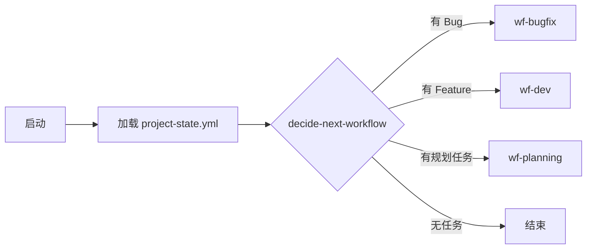

# agent-workflows 常见问题 FAQ

> 版本：1.0.0
> 最后更新：2026-04-09

---

## 📋 工作流选择

### Q1: 如何选择合适的工作流？

**A**: 按复杂度分级：

| 层级 | 工作流 | 适用场景 | 步骤数 |
|:----:|--------|----------|:------:|
| **L0** | wf-patch | 配置修改、文案修改 | 2 |
| **L1** | wf-bugfix | Bug 修复、小功能 | 4 |
| **L1** | wf-quick | 快速原型、验证想法 | 2 |
| **L2** | wf-planning | 需求规划、任务拆分 | 8 |
| **L2** | wf-dev | 功能开发（含审核） | 10+ |
| **L3** | wf-full | 新项目、大功能、完整流程 | 15+ |

**快速判断**：
- 改一个文件 → wf-patch
- 修一个 Bug → wf-bugfix
- 快速验证想法 → wf-quick
- 需要规划任务 → wf-planning
- 开发功能 → wf-dev
- 新项目启动 → wf-full

---

### Q2: wf-dev 和 wf-full 有什么区别？

**A**:

| 维度 | wf-dev | wf-full |
|------|:------:|:-------:|
| 规划阶段 | ❌ 无 | ✅ 有 |
| 约束检查 | ❌ 无 | ✅ 有 |
| E2E 测试 | ❌ 无 | ✅ 有 |
| 步骤数 | 10+ | 15+ |
| 适用场景 | 迭代开发 | 新项目 |

**推荐**：
- 已有 project-state.yml → wf-dev
- 新项目/大功能 → wf-full

---

### Q3: wf-continue 是什么？

**A**: 智能继续工作流，自动判断下一步：



**适用场景**：
- 中断后恢复
- 不知道接下来做什么
- 自动化管理

---

## 🔧 步骤与工具

### Q4: Step 和 Tool 有什么区别？

**A**:

| 维度 | Tool | Step |
|------|------|------|
| **定义** | 原子操作 | Agent 封装 |
| **Agent** | ❌ 无 | ✅ 有（调用 Agent） |
| **Prompt** | ❌ 无 | ✅ 有 |
| **复杂度** | 低（脚本） | 中（Agent 决策） |
| **示例** | git-commit | analyze-architecture |

**类比**：
- Tool = 函数（固定逻辑）
- Step = Agent + Prompt（智能决策）

---

### Q5: 如何定义一个新步骤？

**A**: 标准格式：

```yaml
# steps/xxx.yml
name: step-name
description: 步骤描述

input:
  param1:
    type: string
    required: true

output:
  result1:
    type: string

agent: claude  # 或 codex, pi

prompt: |
  执行步骤的具体提示词
  可使用 ${input.param1} 引用输入

handler: builtin_handler_name  # 可选

retry:
  maxAttempts: 3
  backoff: exponential

timeout: 300000
```

---

### Q6: 如何定义一个新工具？

**A**: 标准格式：

```yaml
# tools/xxx.yml
name: tool-name
description: 工具描述

input:
  param1:
    type: string
    required: true

output:
  result1:
    type: string

handler: builtin_handler_name

# 工具无 Agent、无 Prompt
```

---

## 📂 目录结构

### Q7: steps 分类有哪些？

**A**: 16 个分类：

| 分类 | 说明 | 示例 |
|------|------|------|
| analysis | 分析类 | analyze-architecture, analyze-code |
| design | 设计类 | design-api, design-schema |
| development | 开发类 | fe-dev, be-dev |
| quality | 质量类 | code-review, run-tests |
| planning | 规划类 | generate-tasks, split-tasks |
| governance | 治理类 | constraint-check, review-check |
| project | 项目类 | load-state, save-state |
| backlog | Backlog | add, list, decide |
| bugfix | Bug修复 | diagnose, fix, verify |
| constraint | 约束检查 | check-feature-list |
| deploy | 部署类 | commit-push |
| evolution | 进化类 | report-gap, prioritize |
| file | 文件类 | read, write |
| patch | Patch类 | execute |
| quick | Quick类 | analyze, implement |

---

### Q8: tools 分类有哪些？

**A**: 11 个分类：

| 分类 | 说明 | 示例 |
|------|------|------|
| file | 文件操作 | read, write, edit |
| git | Git 操作 | clone, commit, push |
| spawn | Agent调用 | codex, claude |
| notification | 通知 | discord, wecom |
| browser | 浏览器 | automate, fetch |
| docker | 容器 | build, run |
| npm | 包管理 | install, publish |
| governance | 治理 | define-stance |
| validation | 验证 | validate-yaml |
| verification | 核验 | verify_completion |
| code | 代码 | parse, fingerprint |

---

## 🔄 Backlog 管理

### Q9: backlog.yml 是什么？

**A**: 项目任务统一管理文件：

```yaml
# backlog.yml
project: my-project
features:
  - id: F-001
    title: 用户登录
    status: pending
    priority: P1

bugs:
  - id: B-001
    title: 登录失败
    status: open
    severity: high
```

**用途**：
- 统一入口管理任务
- wf-continue 自动获取下一步
- 跨 session 状态持久化

---

### Q10: 如何添加任务到 Backlog？

**A**: 使用 backlog/add 步骤：

```bash
# 通过 agent-runtime
agent-runtime run backlog/add --input "title=新功能&type=feature&priority=P1"

# 或在 YAML 中定义
steps:
  - backlog/add:
      title: "用户登录"
      type: feature
      priority: P1
```

---

## 🎭 角色与立场

### Q11: 多立场审核是什么？

**A**: 从不同立场审核代码/设计：

| 立场 | 职责 | 图标 |
|------|------|:----:|
| critic | 挑刺、质疑假设 | 🔍 |
| supporter | 支持方案、补充优点 | 🧠 |
| architect | 全局视角、设计合理性 | 🏗️ |
| tester | 边界情况、可测试性 | 🧪 |
| security | 安全漏洞、数据保护 | 🔒 |
| performance | 性能瓶颈、优化建议 | ⚡ |

**触发**：wf-dev 中自动调用 `governance/multi-stance-review`

---

### Q12: 如何定义角色？

**A**: 在 project-state.yml 中：

```yaml
roles:
  - name: developer
    stance: developer
    capabilities:
      - git-commit
      - npm-install
      - code-review
```

---

## 📝 YAML 规范

### Q13: tasks.yml 格式是什么？

**A**: 参考 `docs/tasks-yml-spec.md`：

```yaml
# tasks.yml
tasks:
  - id: T-001
    title: 实现登录 API
    estimated_time: 2h
    dependencies: []
    priority: P1
    status: pending
```

---

### Q14: project-state.yml 格式是什么？

**A**: 参考 `docs/project-state-yml-spec.md`：

```yaml
# project-state.yml
project:
  name: my-project
  path: /tmp/my-project
  
state:
  current_phase: development
  completed_tasks: [T-001, T-002]
  pending_tasks: [T-003]
  
backlog:
  features: [F-001]
  bugs: []
```

---

## 🔗 相关链接

| 文档 | 路径 |
|------|------|
| agent-workflows 架构 | `docs/architecture.md` |
| 工作流开发指南 | `docs/workflow-development-guide.md` |
| 步骤开发指南 | `docs/step-development-guide.md` |
| tasks.yml 规范 | `docs/tasks-yml-spec.md` |
| backlog.yml 规范 | `docs/backlog-yml-spec.md` |
| project-state 规范 | `docs/project-state-yml-spec.md` |
| 最佳实践 | `docs/best-practices.md` |
| 知识库整合 FAQ | `~/knowledge-base/docs/FAQ.md` |

---

*FAQ 维护：agent-workflows 项目*