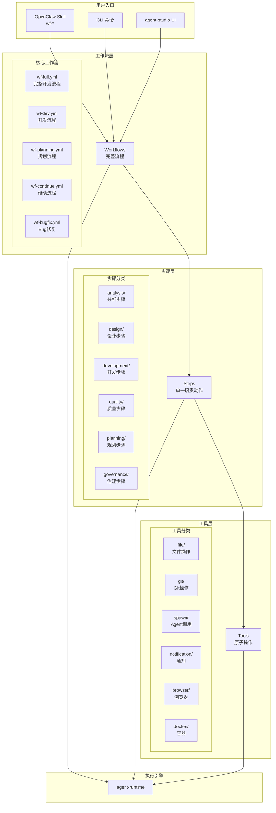
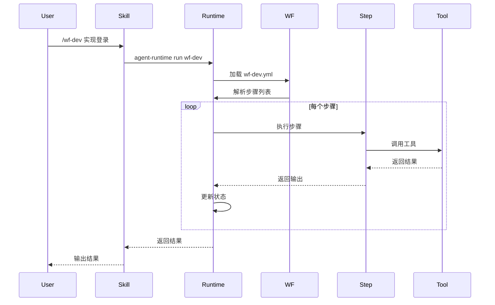
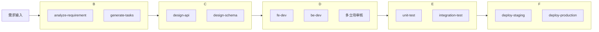
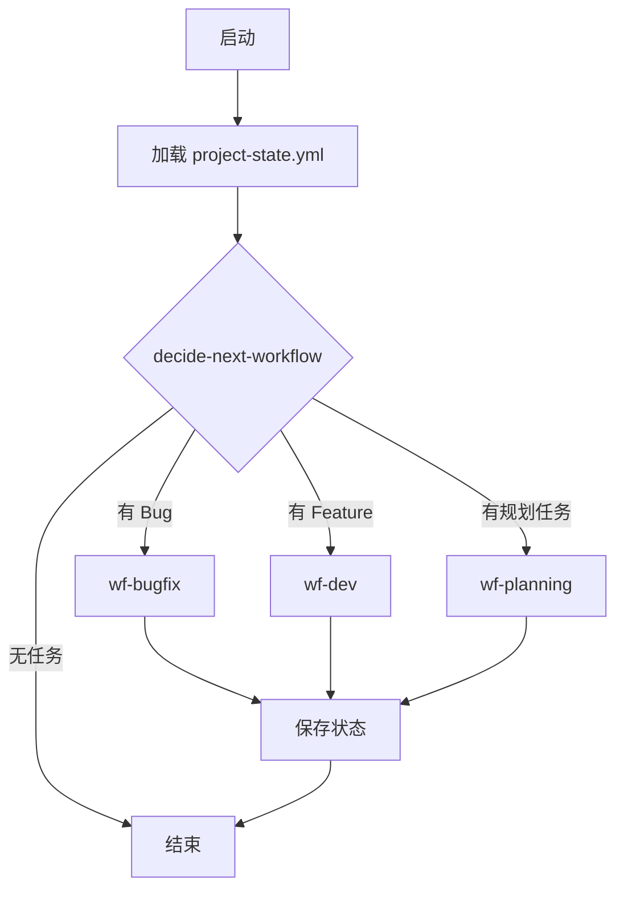
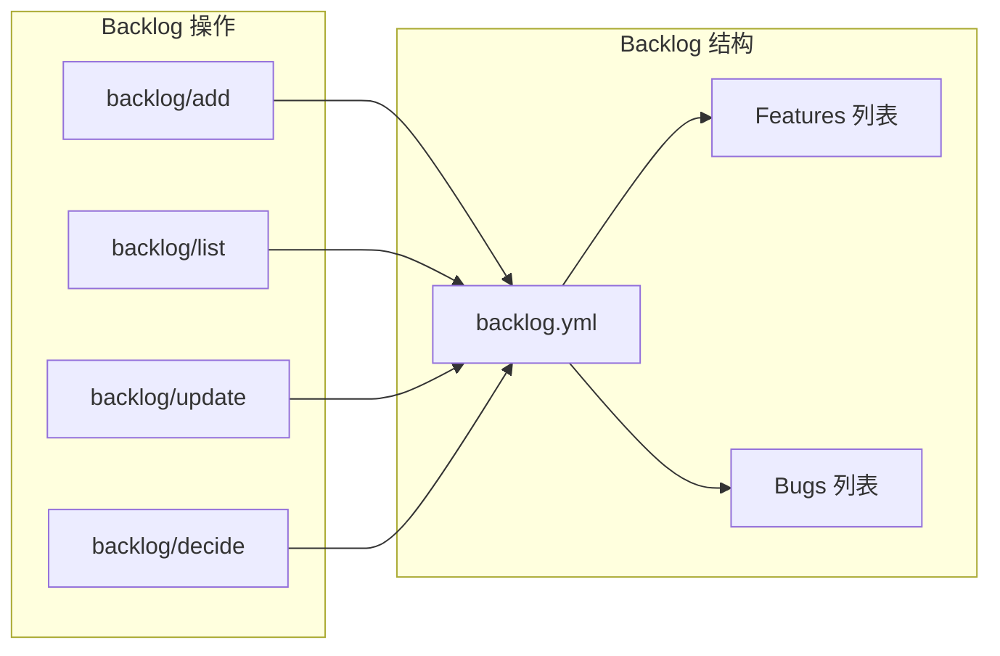
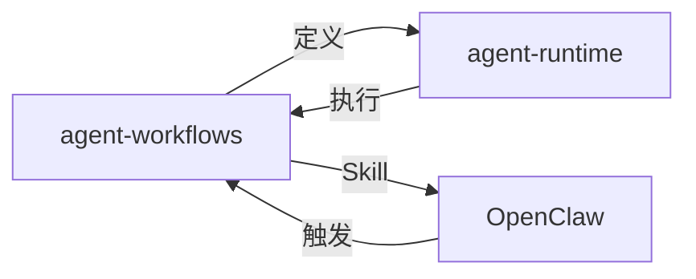

# Agent Workflows 架构设计

> 版本：1.0.0
> 最后更新：2026-04-09

## 一、整体架构



---

## 二、三层架构

### 2.1 工作流层（Workflows）

**职责**：定义完整流程，组合多个步骤

| 工作流 | 用途 | 步骤数 |
|--------|------|--------|
| `wf-full.yml` | 完整软件开发流程 | 15+ |
| `wf-dev.yml` | 开发流程（含多立场审核） | 10+ |
| `wf-planning.yml` | 需求规划、任务拆分 | 8 |
| `wf-continue.yml` | 继续上次工作 | 5 |
| `wf-bugfix.yml` | Bug 修复流程 | 6 |
| `wf-constraint.yml` | 约束检查 | 4 |
| `wf-patch.yml` | 快速补丁 | 3 |
| `wf-quick.yml` | 轻量修复 | 2 |

### 2.2 步骤层（Steps）

**职责**：单一职责动作，可复用

| 分类 | 步骤示例 | 说明 |
|------|----------|------|
| `analysis/` | analyze-architecture, analyze-code | 代码分析 |
| `design/` | design-api, design-schema | 架构设计 |
| `development/` | fe-dev, be-dev, write-code | 开发实现 |
| `quality/` | code-review, run-tests | 质量检查 |
| `planning/` | generate-tasks, split-tasks | 任务规划 |
| `governance/` | constraint-check, review-check | 治理约束 |
| `project/` | load-state, save-state | 状态管理 |
| `backlog/` | add, list, decide | Backlog 管理 |

### 2.3 工具层（Tools）

**职责**：原子操作，无业务逻辑

| 分类 | 工具示例 | 说明 |
|------|----------|------|
| `file/` | read, write, edit | 文件操作 |
| `git/` | status, commit, push | Git 流程 |
| `spawn/` | codex, claude, pi | Agent 调用 |
| `notification/` | discord, wecom, qq | 多渠道通知 |
| `browser/` | search, fetch | Web 操作 |
| `docker/` | build, run, push | 容器操作 |
| `npm/` | install, publish | 包管理 |
| `validation/` | yaml, types, schema | 格式验证 |

---

## 三、工作流调用流程



---

## 四、核心工作流详解

### 4.1 wf-full.yml（完整流程）



### 4.2 wf-dev.yml（开发流程）

```yaml
# wf-dev.yml 核心结构
name: wf-dev
description: 开发流程（含多立场审核）

phases:
  - name: planning
    steps:
      - analyze-requirement
      - generate-tasks
      
  - name: development
    parallel: true
    steps:
      - fe-dev
      - be-dev
      
  - name: review
    stances: [developer, reviewer, qa]
    steps:
      - code-review
      - test-review
      
  - name: completion
    steps:
      - commit-code
      - push-code
```

### 4.3 wf-continue.yml（继续流程）



---

## 五、Backlog 管理



**backlog.yml 结构**：
```yaml
project: my-project
features:
  - id: F-001
    title: 用户登录
    status: pending
    priority: P1
    
bugs:
  - id: B-001
    title: 登录失败
    status: open
    severity: high
```

---

## 六、步骤定义规范

```yaml
# steps/xxx.yml 标准格式
name: step-name
description: 步骤描述

input:
  param1:
    type: string
    required: true
    description: 参数说明

output:
  result1:
    type: string
    description: 输出说明

agent: claude  # 或 codex, pi

prompt: |
  执行步骤的具体提示词
  可使用 ${input.param1} 引用输入

handler: builtin_handler_name  # 或自定义 handler

retry:
  maxAttempts: 3
  backoff: exponential

timeout: 300000  # 5分钟
```

---

## 七、工具定义规范

```yaml
# tools/xxx.yml 标准格式
name: tool-name
description: 工具描述

input:
  param1:
    type: string
    required: true

output:
  result1:
    type: string

handler: builtin_handler_name

# 工具无 Agent、无 Prompt，纯 Handler 执行
```

---

## 八、目录结构

```
agent-workflows/
├── workflows/         # 工作流定义
│   ├── wf-full.yml
│   ├── wf-dev.yml
│   ├── wf-planning.yml
│   ├── wf-continue.yml
│   ├── wf-bugfix.yml
│   ├── wf-constraint.yml
│   ├── wf-patch.yml
│   ├── wf-quick.yml
│   └── wf-dev/        # wf-dev 子工作流
│       ├── planning.yml
│       ├── development.yml
│       └── review.yml
│
├── steps/             # 步骤定义
│   ├── analysis/
│   ├── design/
│   ├── development/
│   ├── quality/
│   ├── planning/
│   ├── governance/
│   ├── project/
│   ├── backlog/
│   ├── bugfix/
│   ├── constraint/
│   ├── deploy/
│   ├── evolution/
│   ├── file/
│   ├── patch/
│   └── quick/
│
├── tools/             # 工具定义
│   ├── file/
│   ├── git/
│   ├── spawn/
│   ├── notification/
│   ├── browser/
│   ├── docker/
│   ├── npm/
│   ├── governance/
│   ├── verification/
│   └── validation/
│
├── skills/            # OpenClaw Skills
│   ├── wf-req/
│   ├── wf-arch/
│   ├── wf-dev/
│   ├── wf-be/
│   ├── wf-fe/
│   ├── wf-test/
│   ├── wf-review/
│   ├── wf-deploy/
│   ├── wf-analyze/
│   ├── wf-compare/
│   ├── wf-deps/
│   ├── wf-perf/
│   └── wf-solo/
│
├── docs/              # 文档
│   ├── architecture.md
│   ├── workflow-development-guide.md
│   ├── step-development-guide.md
│   ├── best-practices.md
│   ├── backlog-yml-spec.md
│   ├── tasks-yml-spec.md
│   └── project-state-yml-spec.md
│
├── tests/             # 测试（BATS）
│
├── CAPABILITIES.md    # 能力清单
├── README.md
└── package.json
```

---

## 九、版本历史

| 版本 | 日期 | 变更 |
|------|------|------|
| 1.0.0 | 2026-04-07 | 约束工作流、规划增强、步骤完善 |
| 0.9.0 | 2026-04-02 | Backlog 管理、Bug 生命周期 |
| 0.8.0 | 2026-03-30 | wf-continue、project-state |
| 0.7.0 | 2026-03-25 | 基础工作流定义 |

---

## 十、依赖关系



---

*文档维护：agent-workflows 项目*
*知识库整合视图：`~/knowledge-base/projects/agent-system-architecture.md`*